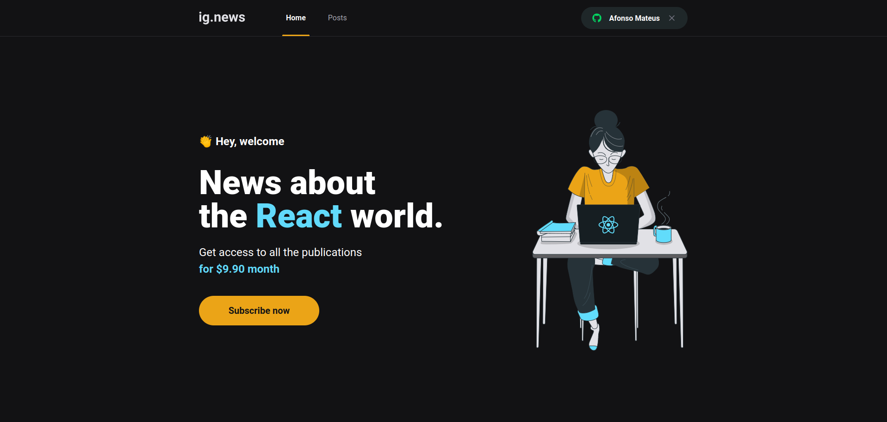
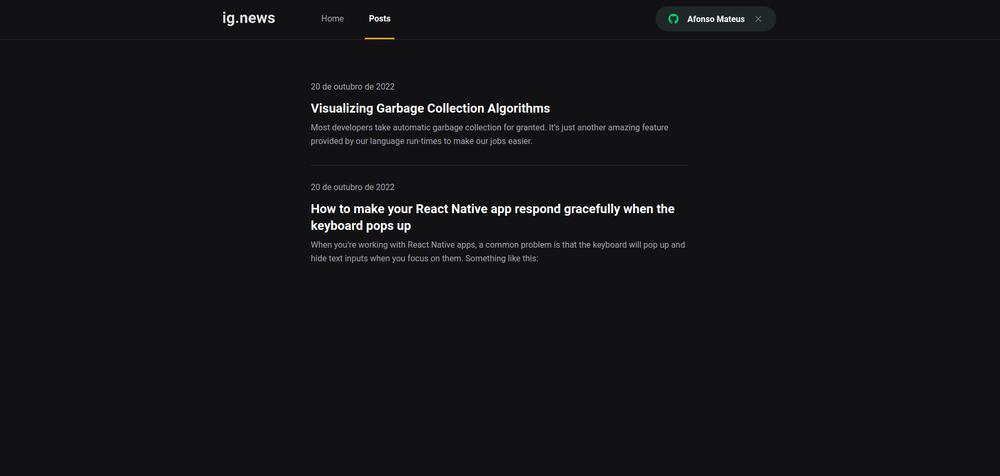

# Ignews
## Projeto para a visualização de textos, utilizando NextJS

# 💻 Sobre
Este projeto foi concebido para o curso de NextJS da Rocketseat. Nele podemos pré visualizar conteúdos de um blog e 
simular um pagamento para visualizar todo o conteúdo. 

<h4 align="center"> 
	🚧  Ignews 🚀 Em construção...  🚧
</h4>

# Funcionalidades
- [x] Autenticação com GitHub
- [x] Cadastro de usuários no FaunaDB
- [x] Pagamento com Stripe
- [x] Consumo dos artigos do Prismic
- [ ] Cadastro das inscrições no FaunaDB

# 🎨 Layout
### Web




# Instalação
### Pré requisitos
Certifique-se de ter o [Node](https://nodejs.org/en/) e o [Git](https://git-scm.com) instalados, além de um gerenciador
de pacotes como o [Yarn](https://yarnpkg.com/) ou o [NPM](https://www.npmjs.com/).

### 🎨 Execução
```bash
# Clone o repositório
$ git clone <https://github.com/afonsomateus21/ignews.git> ou
$ git clone <git@github.com:afonsomateus21/ignews.git> se utilizar SSH

# Instale as dependências
$ npm install ou yarn install

# Execute a aplicação em modo de desenvolvimento
$ npm dev ou yarn dev

# O aplicação ficará disponível na porta:3000 - acesse <http://localhost:3000>
```

# 🛠 Tecnologias
As seguintes tecnologias foram utilizadas na construção do projeto:
- [TypeScript](https://www.typescriptlang.org/)
- [NextJS](https://nextjs.org/)
- [Stripe](https://stripe.com/en-br)
- [FaunaDB](https://fauna.com/)
- [Prismic](https://prismic.io/)

# Autor

### Afonso Mateus
Email: afonsomateus.dev@gmail.com
[Linkedin](https://www.linkedin.com/in/afonso-mateus-3a8522118/)


